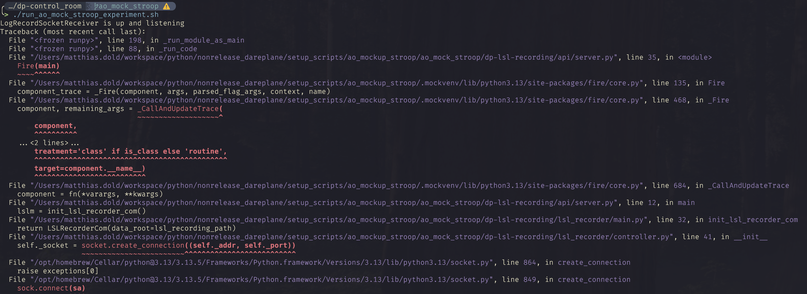

# AO Mockup Stroop example

This setup script provides you with a Dareplane setup containing:

- the [`dp-ao-comm-mockup`](https://github.com/bsdlab/dp-ao-comm-mockup) module - to simulate the communication with the [NeuroOmega's](https://www.alphaomega-eng.com/Neuro-Omega-System) API, usually done with the [`dp-ao-communication`](https://github.com/bsdlab/dp-ao-communication) module.
- the [`dp-stroop`](https://github.com/bsdlab/dp-stroop) to run a the modified or classical Stroop task.
- the [`dp-control-room`](https://github.com/bsdlab/dp-control-room) to provide a GUI for running the experiments.

## Installation

### Python venv

Create a python environment and install the dependencies as of the `requirements.txt` file.

E.g. using [`uv`](https://docs.astral.sh/uv/guides/install-python/):

```
uv venv myvenv
# uv venv --python 3.13 .mockvenv
```

Activate the environment:
On UNIX

```
source .myvenv/bin/activate
```

On Windows

```
.myvenv/Scripts/activate
```

Install the dependencies:

```
uv pip install -r requirements.txt
```

### Running the install script

Download and configure using:

```
python setup_ao-mock_stroop_experiment.py
```

### Post install

#### Building the AO mockup

```
cd ao_mockup_stroop/dp-ao-comm-mockup
```

Then assuming you have [`meson`](https://mesonbuild.com/) installed, follow the `README.md` in this module and adjust the `meson.build` config.
To build you can then use

```
meson setup build
meson compile -C build
```

After a successful build, you should be able to run `./build/ao_comm`.

## Running the control room

From this directory, navigate into the `dp-control-room`.

```
cd ao_mockup_stroop/dp-control-room
```

The directory will include a script to run the control room. This might need to be made executable on UNIX systems by:

```
chmod +x run_ao_mock_stroop_experiment.sh
```

Make sure the `ao_comm` and the [Labrecorder](https://github.com/labstreaminglayer/App-LabRecorder) are running. Then start the control room with:

```
./run_ao_mock_stroop_experiment.sh
```

## Trouble shooting

Should you encounter an error message like this, then most likely the [Labrecorder](https://github.com/labstreaminglayer/App-LabRecorder) is not running:

